<!--
  GitHub profile README for github.com/sasankreddyvenna
  This file must live in a PUBLIC repo named exactly "sasankreddyvenna",
  at the repo root. GitHub then renders it at the top of your profile.

  The banner is ./assets/banner-light.svg + banner-dark.svg — edit the
  text inside those files if your title or location changes. Both files
  carry the same text, so change it in both.
-->

<picture>
  <source media="(prefers-color-scheme: dark)" srcset="./assets/banner-dark.svg">
  
</picture>

I build web applications end to end and small, sharp tools on top of LLMs —
retrieval pipelines, document-grounded generation, and agents that produce
something you can actually run. Most of what's below started as a real problem
someone had rather than a tutorial.

Based in Vijayawada, India. Final-year B.Tech CSE at VIT-AP University, graduating 2026.
Currently going deeper on **distributed systems, testing discipline, and applied GenAI**.

---

## Stack

<table>
<tr>
<td><b>Languages</b></td>
<td>

</td>
</tr>
<tr>
<td><b>Backend&nbsp;&amp;&nbsp;data</b></td>
<td>

</td>
</tr>
<tr>
<td><b>Frontend</b></td>
<td>

</td>
</tr>
<tr>
<td><b>Cloud&nbsp;&amp;&nbsp;AI</b></td>
<td>

</td>
</tr>
</table>

---

## Selected work

| Project | What it does | Stack |
|---|---|---|
| **[ACME CPM](https://github.com/sasankreddyvenna/acme-project-management)** [live&nbsp;site](https://acme-project-management.vercel.app) | Centralised project management — projects, deliverables, resource allocation and budgets, with role-based access across five roles. Built solo in a 3-day engineering workshop. | React · Python · PostgreSQL · Vercel |
| **[Autonomous QA Agent](https://github.com/sasankreddyvenna/Autonomous-QA-Agent)** | Upload requirement documents, get test cases grounded in their contents, then generate a downloadable Selenium script from any chosen case. | Flask · ChromaDB · Groq |
| **[Knowledge-base Search Engine](https://github.com/sasankreddyvenna/Knowledge-base-Search-Engine)** | RAG over uploaded PDFs. Answers from retrieved context when the question matches the corpus, and falls back to a plain model answer when it doesn't. | Flask · FAISS · SentenceTransformers · Gemini |
| **[Customer 360 AI Dashboard](https://github.com/sasankreddyvenna/Customer-360-AI-Dashboard)** | Brings customer information that's scattered across systems into one view, so sales and success teams can pick up context quickly. | Python |
| **[Anjaneya Mobiles](https://github.com/sasankreddyvenna/anjaneyamobiles)** | Site for a phone repair shop: open/closed status computed in IST regardless of visitor timezone, a tap-to-build WhatsApp quote flow, and LocalBusiness structured data. No build step. | HTML · Cloudflare Pages |
| **[F1 Streetwear](https://github.com/sasankreddyvenna/F1-inspired-streetwear-brand)** [live&nbsp;site](https://f1-inspired-streetwear-brand.vercel.app) | Storefront UI — catalogue, live search filtering with an empty state, and a cart with quantity adjustment. | React · TypeScript · Tailwind |

---

## Certifications

**MongoDB Certified Database Administrator** · **Salesforce Certified AI Agent Developer**

<!-- Add further certifications to the line above, separated by " · ". -->

---

## Contact

<!--
  Deliberately no GitHub stats / streak / top-languages cards. With the current
  contribution history they draw attention to commit counts rather than to the
  projects, which is the opposite of what you want. Worth revisiting later.
-->
